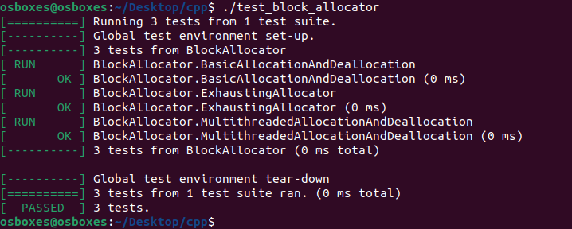

Разработать модуль для программы на языке c/c++, выполняющую роль блочного аллокатора памяти.
Размер одного блока памяти и количество резервируемых аллокатором блоков указываются в качестве параметров при создании объекта аллокатора.

Требования к модулю:
* должен работать в условиях многозадачного окружения, то есть должен быть потокобезопасным;
* покрыт набором юнит-тестов, в том числе покрывающих распространенные исключительные ситуации при работе с кодом аллокатора в многопоточной среде;
* документирован – публичное API, используя doxygen;

Условия, требующие уточнения, трактуйте на свое усмотрение и оставьте об этом соответствующий комментарий к решению (предпочтительно в виде комментария в файлах исходного кода).

P.S. Компилятор gcc, приложить Makefile для сборки.

